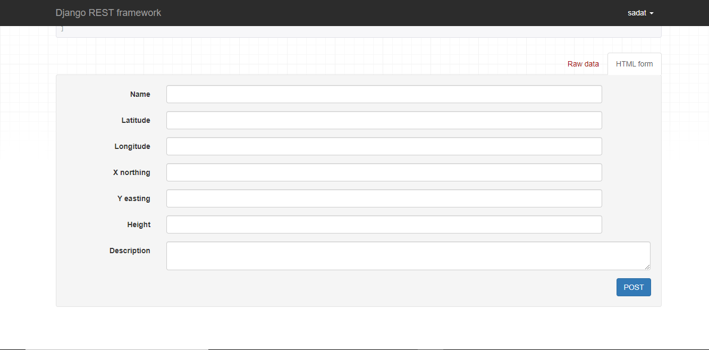

# An API for the KNUST Control Points

This project provides the general public access the necessary information of all the known control points in knust as of the year 2021,for the purposes of web and mobile application. It is an extension of my final year thesis on the topic of the "DENSIFICATION OF KNUST CAMPUS CONTROLS" by "ANWUR SADAT YUSSUF ISSAH & BENNET DWUMOH", a website was made to show the control points on a map, which can be found here [Knust Controls Web App](https://knustcontrolpts.web.app/)

## List View for the API

## Post View for the API

## Detail and Delete View for the API

